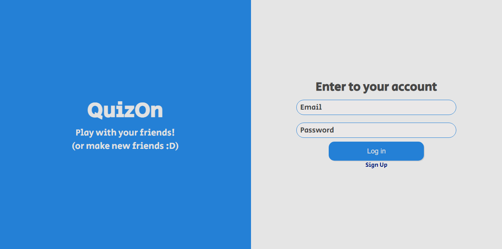
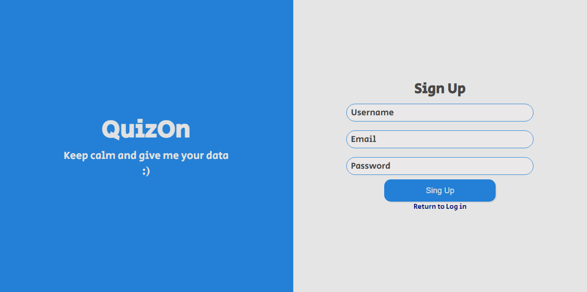
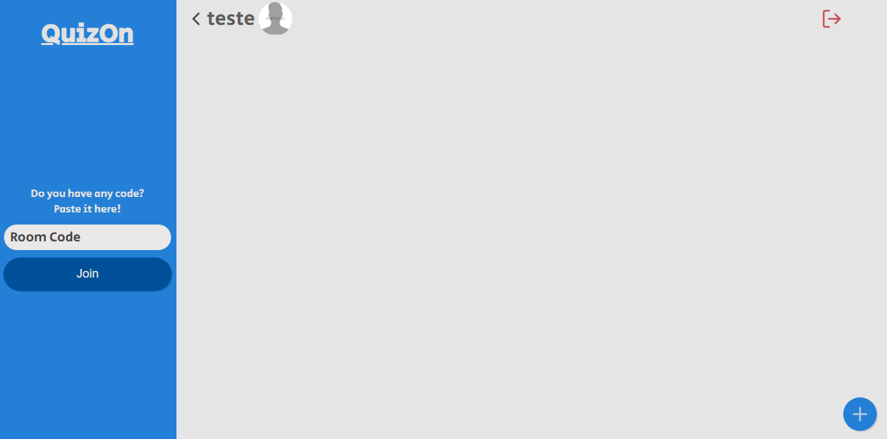
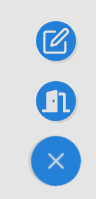
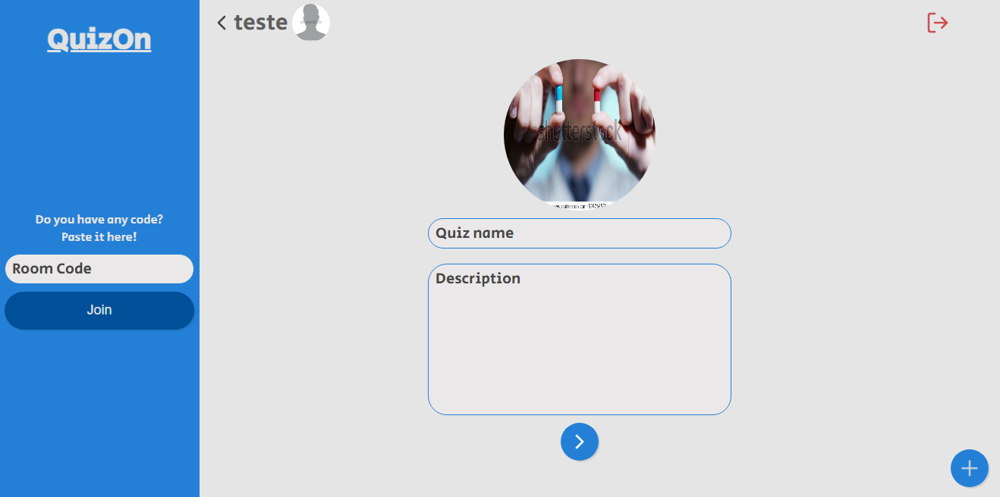
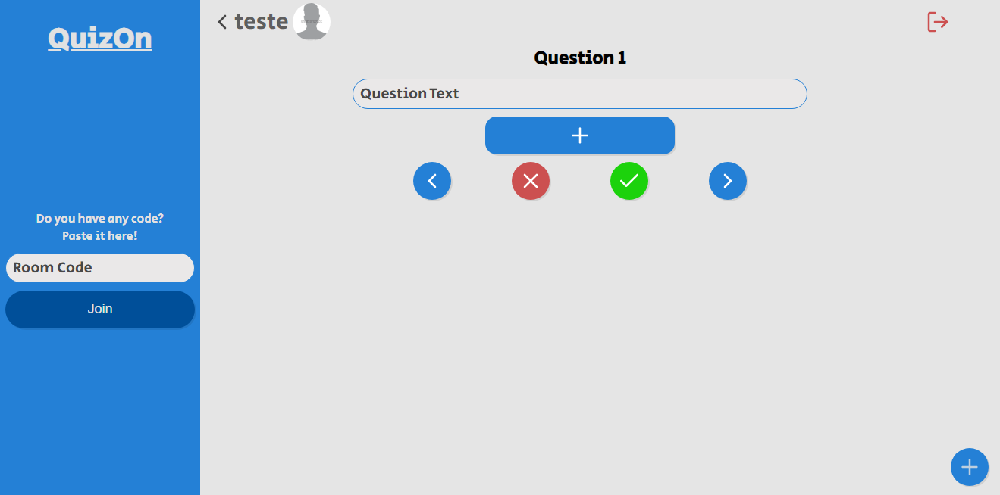
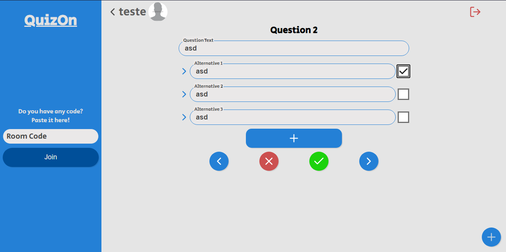
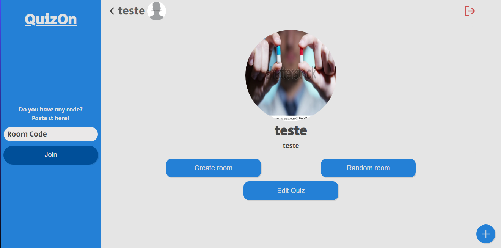

# QuizOn - Projeto de um Quiz Online (Em desenvolvimento)

## Funcionalidades
 - [x] Criar, atualizar, consultar e deletar usuário.
 - [x] Criar, atualizar, consultar e deletar quizzes.
 - [x] Responder perguntas e aumentar Score.
 - [X] Upload de imagens no Backend.
 - [X] SocketIO para criar salas e ter funcionalidades online.
 - [ ] Página que mostra todos os quizzes, seus quizzes ou todas as salas.
 - [ ] Mudar senha de um usuário.
 - [ ] Recuperar senha.

## Tecnologias
- Backend
    - NodeJS
    - Express
    - KnexJS (Atualmente usando um arquivo SQLite)
    - JWT (Ainda não implementado)
    - SocketIO (Ainda não implementado)
    

<br />

- Frontend
    - ReactJS
    - Axios
    - SocketIO (Ainda não implementado)
    
<br />

**OBS:** Lembre-se que os comandos devem ser usados no terminal/prompt de comando.

## Rodando o projeto
- Clone o projeto
    ```
    git clone https://github.com/HigorJ/QuizOn.git
    ```

### Rodar o Backend
- Vá para a pasta server
    ```
    cd server
    ```

- Rode o seguinte comando para instalar as dependências do projeto (Caso já tenha o NPM instalado)
    ```
    npm install
    ```

- Para criar o arquivo SQLite rode o seguinte comando
    ```
    npm run knex:migrate
    ```

- Agora só falta rodar o comando para iniciar o backend
    ```
    npm run start
    ```

- Pronto, o servidor está rodando. Agora falta rodar o Frontend em outro terminal.

<br />

### Rodar o Frontend
- Se estiver na pasta QuizOn, rode o seguinte comando (Se não estiver, vá para essa pasta e rode o comando)
    ```
    cd web
    ```

- Rode o seguinte comando para instalar as dependências do projeto (Caso já tenha o NPM instalado)
    ```
    npm install
    ```

- Para iniciar o projeto em ReactJS, use o seguinte comando
    ```
    npm run start
    ```

- Pronto, o Frontend está rodando.

<br />

### Telas (Modelo antigo, algumas coisas foram alteradas)
- Ao iniciar, está será a tela apresentada

<p align="center">
  
</p>

- Para poder se logar, registre-se clicando em Sign Up

<p align="center">
  
</p>

- A tela inicial, sem nenhum quiz, estará da seguinte forma
<p align="center">
  
</p>

- Ao clicar no botão vermelho na parte de cima à direita, você fará Logout da aplicação.

- Ao clicar na sua imagem/nome/seta no header, você irá para o seu perfil
<p align="center">
  
</p>

- Ao clicar em "Edit" os campos de texto ficarão disponíveis para poder editar suas informações e, caso a senha digitada for correta, elas serão atualizadas. (Ainda não tem como mudar a senha de um usuário).

- Ao clicar em Lobby no header, ele voltará ao lobby.

- Se clicar no símbolo de "+", abrirão duas opções
<p align="center">
  
</p>

- Ao clicar no ícone de caneta e papel, você irá ir para a tela de criação de um Quiz. Caso clique no ícone de porta, irá para a criação de uma sala.

- A tela de criação de quiz é a seguinte
<p align="center">
  
</p>

- Ao adicionar um nome e descrição, clique no botão com uma seta, a próxima tela será para criar uma alternativa
<p align="center">
  
</p>

- Adicione quantas alternativas quiser, clique na seta para direita para adicionar mais questões
<p align="center">
  
</p>

- Para concluir o quiz, aperte no botão verde. Caso deseje cancelar ele, clique no botão vermelho.

- Ao voltar ao lobby, haverá 1 quiz, caso tenha criado ele. Ao clicar no quiz, terá a tela de informações dele. Caso seja o autor do quiz, poderá editar
<p align="center">
  
</p>

- Se inicar o quiz, poderá responder, caso a resposta esteja correta, ele incrementará a pontuação. Ao final haverá uma mensagem simples de que o quiz acabou.