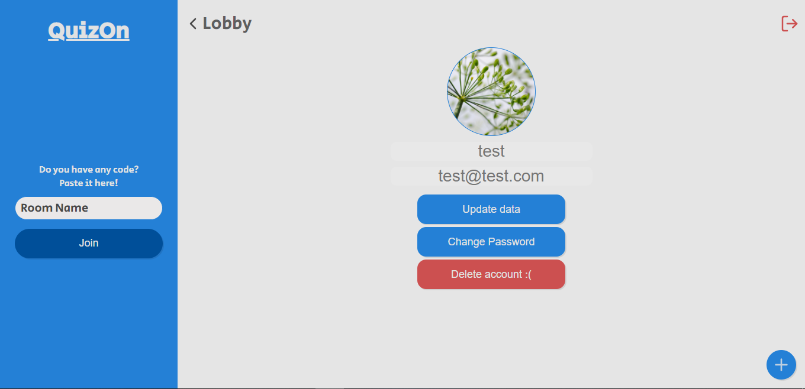

# QuizOn - Projeto de um Quiz Online

## Funcionalidades
 - [x] Criar, atualizar, consultar e deletar usuário.
 - [x] Criar, atualizar, consultar e deletar quizzes.
 - [x] Responder perguntas e aumentar Score.
 - [x] Upload de imagens no Backend.
 - [x] SocketIO para criar salas e ter funcionalidades online.
 - [x] Recuperar senha.
 - [x] Mudar senha de um usuário.
 - [x] Página que mostra todos os quizzes, seus quizzes e as salas.
 - [x] JWT.
 - [ ] Botão de "random room".
 - [ ] Colocar foto em uma sala.
 - [ ] Chat online durante o quiz.

## Tecnologias
- Backend
    - NodeJS
    - Express
    - KnexJS (Atualmente usando um arquivo SQLite)
    - JWT (Ainda não implementado)
    - SocketIO
    

<br />

- Frontend
    - ReactJS
    - Axios
    - SocketIO
    
<br />

**OBS:** Lembre-se que os comandos devem ser usados no terminal/prompt de comando.

## Rodando o projeto
- Clone o projeto
    ```
    git clone https://github.com/HigorJ/QuizOn.git
    ```

### Rodar o Backend
- Vá para a pasta server
    ```
    cd server
    ```

- Rode o seguinte comando para instalar as dependências do projeto (Caso já tenha o NPM instalado)
    ```
    npm install
    ```

- Para criar o arquivo SQLite rode o seguinte comando
    ```
    npm run knex:migrate
    ```

- Agora só falta rodar o comando para iniciar o backend
    ```
    npm run start
    ```

- Pronto, o servidor está rodando. Agora falta rodar o Frontend em outro terminal.

<br />

### Rodar o Frontend
- Se estiver na pasta QuizOn, rode o seguinte comando (Se não estiver, vá para essa pasta e rode o comando)
    ```
    cd web
    ```

- Rode o seguinte comando para instalar as dependências do projeto (Caso já tenha o NPM instalado)
    ```
    npm install
    ```

- Para iniciar o projeto em ReactJS, use o seguinte comando
    ```
    npm run start
    ```

- Pronto, o Frontend está rodando.

<br />

### Imagens
**OBS**: Para conseguir jogar com outra pessoa localmente, é necessário abrir o site em outro navegador e usar outra conta.

  - GIF com as funcionalidades:
    <p align="center">
      
    </p>

  - Imagem da página de perfil:
    <p align="center">
      
    </p>